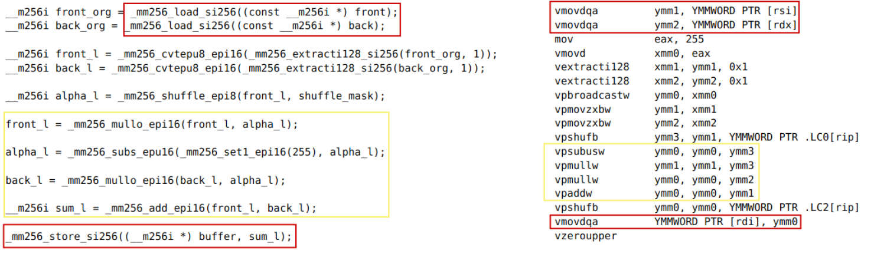

# Alpha Blending

## Цель

Закрепить умение оптимизировать повторяющиеся однотипные вычисления на CPU с помощью SIMD и писать красивые README. (см также [Mandelbrot-Set](https://github.com/AndrewGlebovski/Mandelbrot-Set))

## Введение

Alpha Blending - процесс наложения изображения на фоновое изображение с учетом прозрачности. Несмотря на простототу вычисления цвета каждого пикселя, задача может быть оптимизирована с помощью SIMD.

## Ход работы

Сначала будем вычислять цвет каждого "наивным" образом, т.е. по одному пикселю за итерацию внутреннего цикла. Далее воспользуемся SIMD и будем считать по 8 пикселей за итерацию (Команды AVX2 используют регистры на 256 бит, значит в один регистр вмещается 8 float чисел). Замерим и сравним FPS в обоих случаях.

## Анализ работы компилятора

С помощью сайта godbolt.org проанализируем существенные различия при компиляции "наивной" и SIMD реализаций.

[Полный результат наивной реализации](https://godbolt.org/z/faMKhW3T6)

[Полный результат SIMD реализации](https://godbolt.org/z/nchY8YYrT)

**Красным цветом обведены обращения к памяти. Желтым - арифметические операции**

В наивной реализации компилятор обращается к памяти за каждым байтом, что даже с учетом неплохой локальности сильно замедляет расчет цвета пикселя. Кроме того наивный алгоритм производит ровно 3 сложения и 6 умножений над каждым пикселем.

В SIMD реализиции компилятор читает по 32 байта за раз, работает с ними и также записывает в память, сильно сокращая время работы с памятью. Также SIMD производит арифметический команды над 8 пикселями сразу.

## Результат

**Замечания**
- Все измерения производились с опцией -O2 компилятора gcc, а также набором инструкций AVX2
- Для того, чтобы уменьшить влияние факторов не связанных с вычислением множества, я считаю пиксели 10000 раз после чего умножаю полученный FPS на 10000
- Замеры происходили при питании от зарядки, в одно и то же время

Средний FPS, полученный измерением "на глаз":

| SIMD | FPS   |
| ---- | ----- |
| Off  | 1242  |
| On   | 4804  |

Коэффициент ускорения:

|                | Коэффициент ускорения |
| -------------- | --------------------- |
| Теоретический  | 8                     |
| Практический   | 3.8                   |

## Вывод

Использование SIMD позволяет свернуть несколько итераций цикла в одну, если каждая итерация выполняется независимо от других, что позволяет существенно ускорить выполнение цикла. Для достижения таких оптимизаций требуется тесное соотрудничество между программистом и компилятором.
