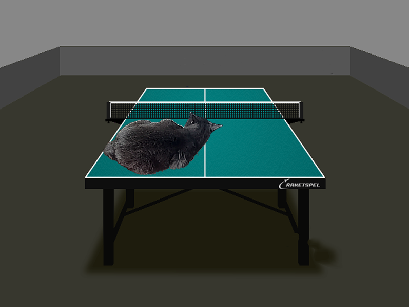
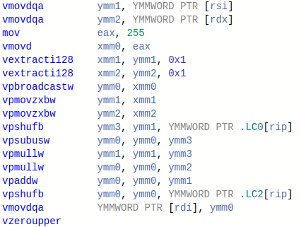
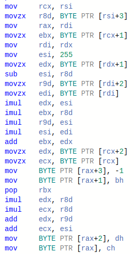

# Alpha Blending





## Использование


Скомпилировать проект можно с помощью команды (**вам потребуется библиотека sfml**)
```
make
```

При запуске программа наложит изображение *assets/AskhatCat.bmp* на *assets/Table.bmp* и выведет результат в окно размером *800x600*. *Размер изображений фиксирован.*


## Цель


Закрепить умение оптимизировать вычисления на CPU с помощью SIMD (см. также [Mandelbrot-Set](https://github.com/AndrewGlebovski/Mandelbrot-Set)).


## Введение


Alpha Blending - процесс наложения изображения на фоновое изображение с учетом прозрачности. Цвета каждого пикселя вычисляется по следующей формуле

```
pixel.red   = (foreground_pixel.red   * foreground_pixel.alpha + background_pixel.red   * (255 - foreground_pixel.alpha)) << 8

pixel.green = (foreground_pixel.green * foreground_pixel.alpha + background_pixel.green * (255 - foreground_pixel.alpha)) << 8

pixel.blue  = (foreground_pixel.blue  * foreground_pixel.alpha + background_pixel.blue  * (255 - foreground_pixel.alpha)) << 8

pixel.alpha = 255
```

Т.к. пиксели вычисляются независимо друг от друга, то можно подсчитать сразу несколько с помощью SIMD.


## Ход работы


- Был реализован базовый алгоритм, вычисляющий цвет одного пикселя за одну итерацию внутреннего цикла.
- Был реализован алгоритм, использующий SIMD, чтобы вычислять по 8 пикселей за итерацию (команды AVX2 используют регистры на 256 бит, при этом каждый пиксель занимает 4 байта, значит в один регистр помещается 8 int чисел, т.е. 8 пикселей)
- Было замерено время работы функции блендинга в обоих случаях.

Стоит отметить одну особенность в исполнении. Т.к. при умножении целых чисел может возникнуть переполнение, то 256-битный регистр был разбит пополам на два 128-битных, размер каждого операнда был расширен с одного байта до двух (*команда _mm256_cvtepu8_epi16*) и арифметические операции производились с ними. После каждый операнд был уменьшен с двух байт до одного, был взят старший байт, и "склеены" получившиеся 128-битные регистры.


## Анализ работы компилятора


Рассмотрим фрагменты кода, вычисляющие цвета пикселей. Первым идет код SIMD реализации, далее базовой. Как видно, базовый алгоритм считывает из памяти 4 байта и производит отдельные вычисления для красного, зеленого и синего цветов. SIMD считывает уже 32 байта и обрабатывает одновременно все цвета у 8 пикселей.

```C
__m256i front_org   = _mm256_load_si256((const __m256i *) front);
__m256i back_org    = _mm256_load_si256((const __m256i *) back);

__m256i front_l = _mm256_cvtepu8_epi16(_mm256_extracti128_si256(front_org, 1));
__m256i back_l  = _mm256_cvtepu8_epi16(_mm256_extracti128_si256(back_org, 1));

front_l = _mm256_mullo_epi16(front_l, alpha_l);

alpha_l = _mm256_subs_epu16(_mm256_set1_epi16(255), alpha_l);
back_l  = _mm256_mullo_epi16(back_l, alpha_l);

__m256i sum_l = _mm256_add_epi16(front_l, back_l);
```

```C
PixelColor fr = {}; memcpy(&fr, front, 4);
PixelColor bg = {}; memcpy(&bg, back, 4);

fr = {
    (uint8_t) ((fr.r * alpha + bg.r * (255u - alpha)) >> 8),
    (uint8_t) ((fr.g * alpha + bg.g * (255u - alpha)) >> 8),
    (uint8_t) ((fr.b * alpha + bg.b * (255u - alpha)) >> 8),
    255u
};
```

С помощью сайта godbolt.org проанализируем различия при компиляции базовой и SIMD реализаций. Все программы компилировались с флагами -O2 и -mavx2. В случае с SIMD, компилятор смог распараллелить вычисления с помощью AVX инструкций, таким образом обрабатывая по 8 пикселей за раз. В случае базовой реализации, компилятор не применил параллелизм, чем сильно замедлил работу программы.

|   |  |
| ---------------------------------- | ---------------------------------- |
| SIMD реализация                    | Наивная реализация                 | 

Полный вывод компилятора вы найдете здесь:

[Наивная реализация](https://godbolt.org/z/faMKhW3T6)

[SIMD реализация](https://godbolt.org/z/nchY8YYrT)


## Результат


**Условия**
- Все измерения производились с опцией -O2 компилятора gcc, а также набором инструкций AVX2.
- Для того, чтобы увеличить влияние арифметических вычислений, обсчет пикселей производился по 8 раз.
- Компьютер был подключен к сети, чтобы система не снимала нагрузку с CPU для экономии заряда.
- Замеры проводились при одной температуре CPU (44.2), чтобы избежать искажения показаний из-за троттлинга CPU.

| Версия   | Время (секунды)      | Среднеквадратическое отклонение |
| -------- | -------------------- | ------------------------------- |
| Базовая  | 0.013                | 0.002                           |
| C SIMD   | 0.0018               | 0.0004                          |

Коэффициент ускорения рассчитывается по формуле $\frac{FPSWithSIMD}{FPSWithoutSIMD}$ и равен **7.22**.


## Вывод


Использование SIMD позволяет свернуть несколько итераций цикла в одну, если каждая итерация выполняется независимо от других, что позволяет существенно ускорить выполнение цикла. Для этого используются специальные ассемблерные вставки (*intrinsics*), поддерживаемые компилятором.
